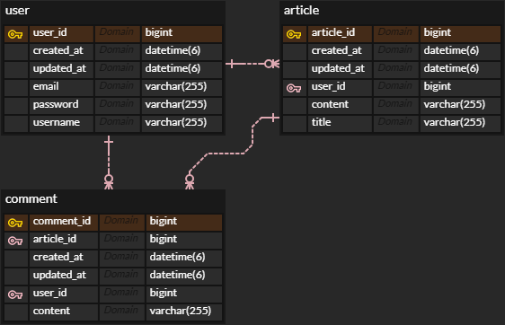

# yourlog

간단한 블로그 만들기

## 프로젝트 세팅

- Build Tool: Gradle
- Language: Java
- Java Version: 21

## API Endpoint

| 동작    | URI                                        | Method |
|-------|--------------------------------------------|--------|
| 회원 가입 | /user                                      | post   |
| 회원 탈퇴 | /user                                      | delete |
| 글 작성  | /article                                   | post   |
| 글 수정  | /article/{id}                              | post   |
| 글 삭제  | /article/{id}                              | delete |
| 댓글 작성 | /article/{article_id}/comment              | post   |
| 댓글 수정 | /article/{article_id}/comment/{comment_id} | post   |
| 댓글 삭제 | /article/{article_id}/comment/{comment_id} | delete |

## Error Response

```json
{
  "time": "2024-09-17T10:00:00.0000000",
  "status": "BAD_REQUEST",
  "message": "error message",
  "requestURI": "/article/150"
}
```

## 과제 명세

- 테스트 코드 최대한 작성
- 라이브러리 자유롭게 사용
- API endpoint는 직접 작성
- MySQL 사용 권장
- 로그인 기능 선택 사항
- view, read 구현하지 않기

### ERD


### 회원가입

- 비밀번호 암호화 적용
- 별도의 Validation 필요하지 않음

### 회원 탈퇴

- 해당 회원이 작성한 게시글과 댓글도 모두 삭제

### 게시글 작성

- title, content 필드에 “”, “ “, null 비허용

### 게시글 수정

- id는 Path Variable로
- title, content 필드에 “”, “ “, null 비허용
- 자신의 게시글만 수정 가능

### 게시글 삭제

- id는 Path Variable로
- 해당 게시글에 있는 댓글도 모두 삭제
- 자신의 게시글만 삭제 가능

### 댓글 작성

- content 필드에 “”, “ “, null 비허용
- Path Variable, Body 필드 중 선택하여 id 받기

### 댓글 수정

- id는 Path Variable로
- content 필드에 “”, “ “, null 비허용
- 자신의 댓글만 수정 가능

### 댓글 삭제

- id는 Path Variable로
- 자신의 댓글만 삭제 가능
